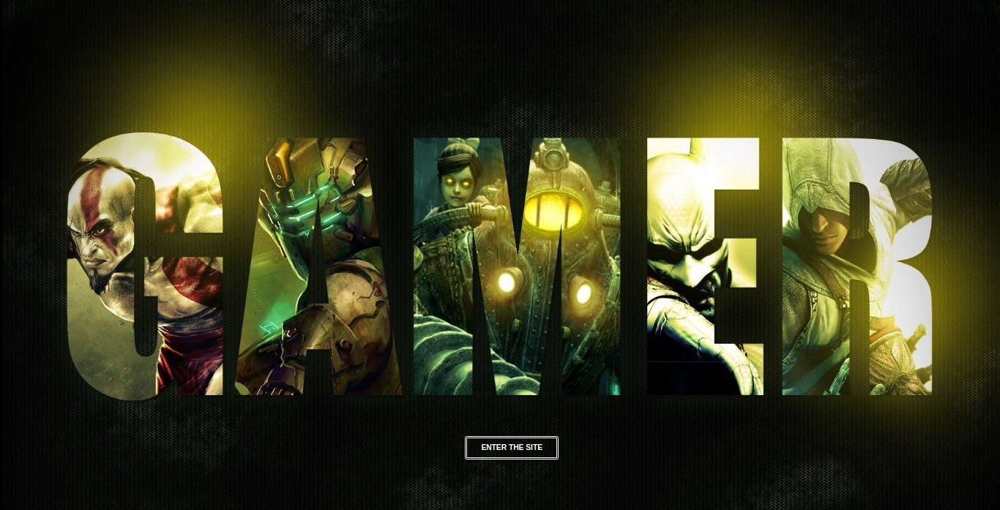
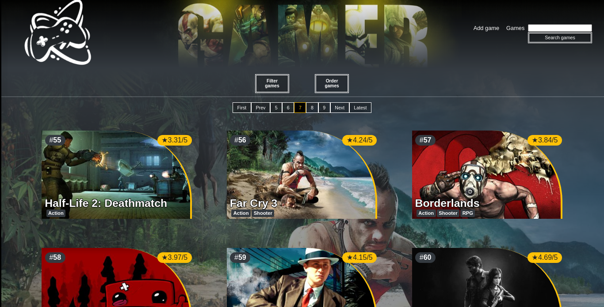
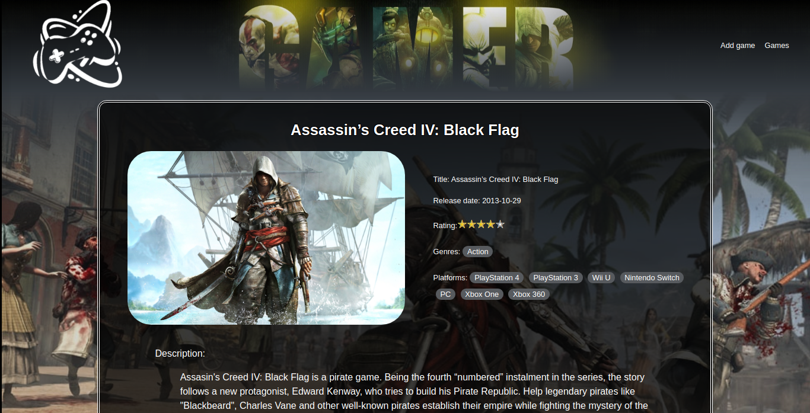
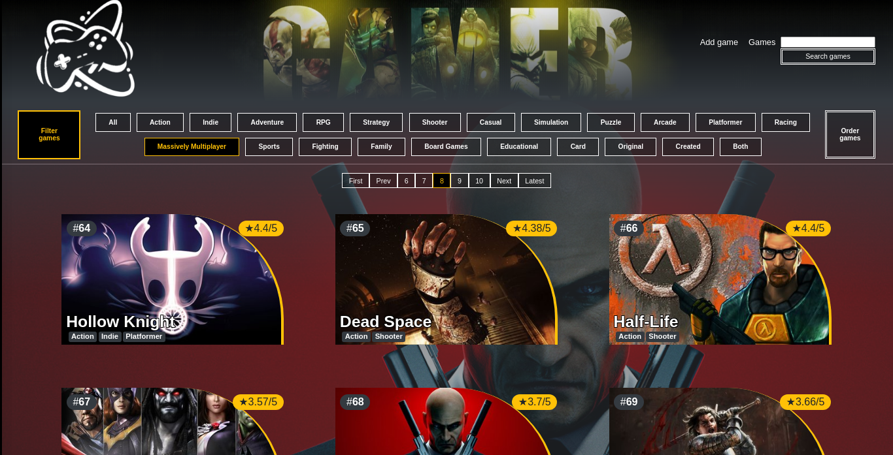
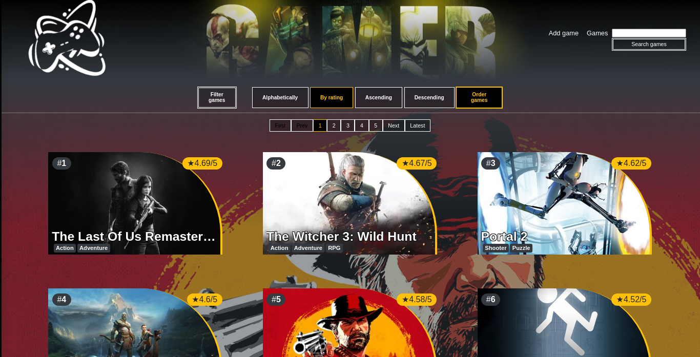
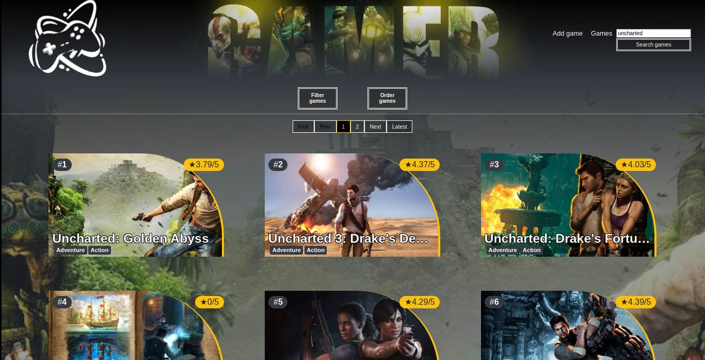
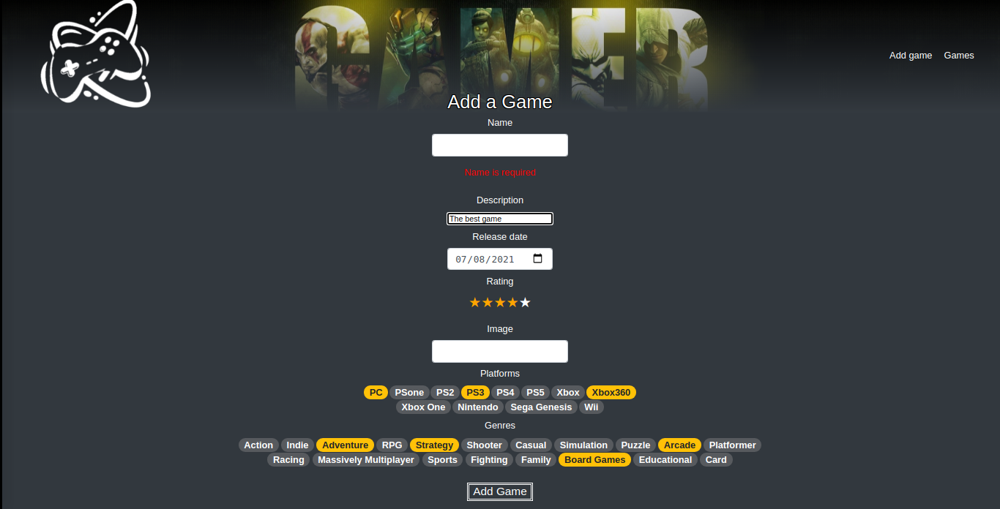

    

# Individual Project - Henry Videogames

  

## Objetivos del Proyecto

- Construir una App utlizando React, Redux, Node y Sequelize.
- Afirmar y conectar los conceptos aprendidos durante el bootcamp de Henry.
- Aprender mejores prácticas de programación.
- Aprender y practicar el workflow de GIT.
- Usar y practicar testing.

La idea general era crear una aplicación en la cual se puedan ver los distintos videojuegos disponibles junto con información relevante de los mismos utilizando la api externa [rawg](https://rawg.io/apidocs) y a partir de ella poder, entre otras cosas:

  - Buscar videjuegos
  - Filtrarlos / Ordenarlos
  - Agregar nuevos videojuegos

## Web
Luego de concluido el proyecto, tanto la api de backend como app del cliente fueron alojados en un hosting VPS (digitalocean) incorporando certificados de seguridad SSL

https://www.jpgamer.xyz/

## Capturas

